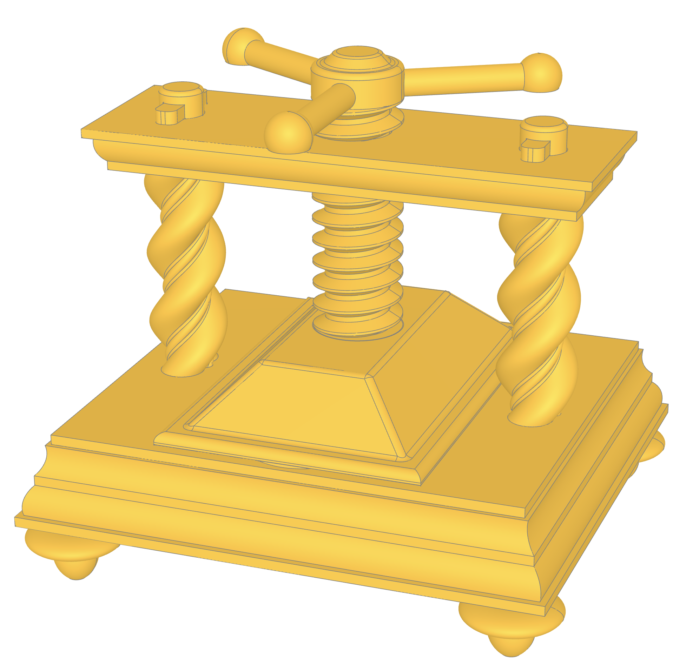
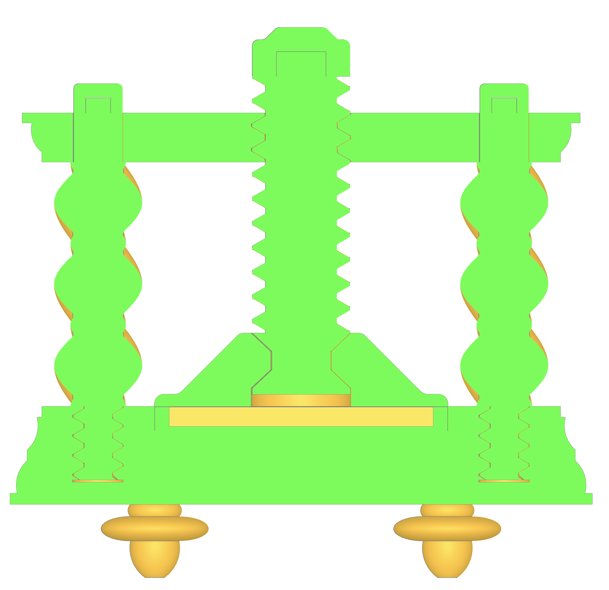
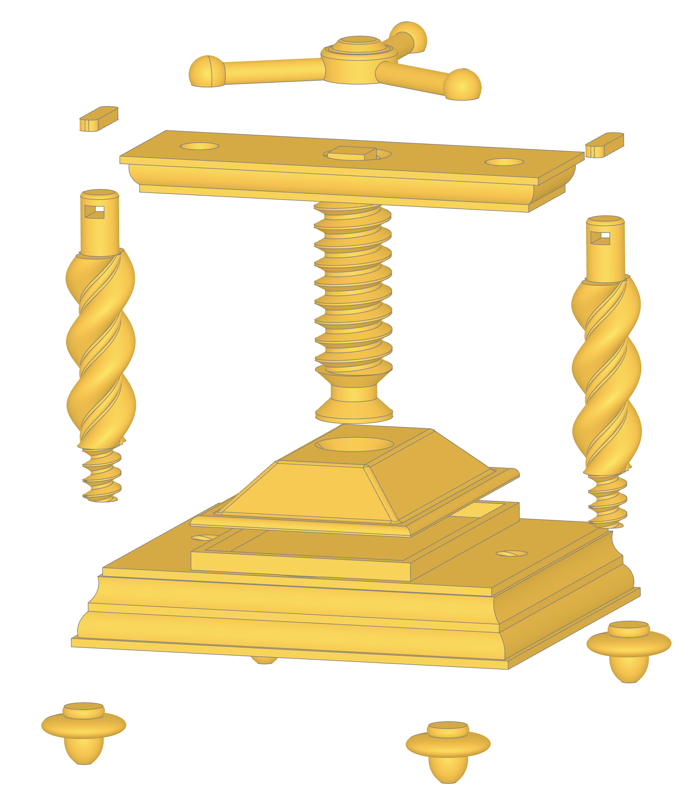

# A printing press model

*Made with the [build123d](https://github.com/gumyr/build123d) CAD Python library*





## Setup

You might need to use pyenv to enforce the version found in `.python-version`.

```
python -m venv venv
venv/Scripts/Activate.ps1 or . venv/bin/activate
pip install -r requirements.txt
```

## Running the watcher and viewer

``` 
fw123d printpress.py
```

Open `http://127.0.0.1:3939/viewer` in browser. The view updates anytime the source is saved. Comment out some parts for faster execution.

You can also comment out the live viewer imports and calls and just run `python printpress.py` for a single execution and export.

## License

- The source code is release under the [MIT license](license.txt). I'd love to hear if you build something based on this project!
- The Canterbury and Gutenberg Textura fonts licensed under the 1001Fonts Free For Commercial Use License (FFC)
- Textura is licensed under the SIL Open Font License (OFL)
